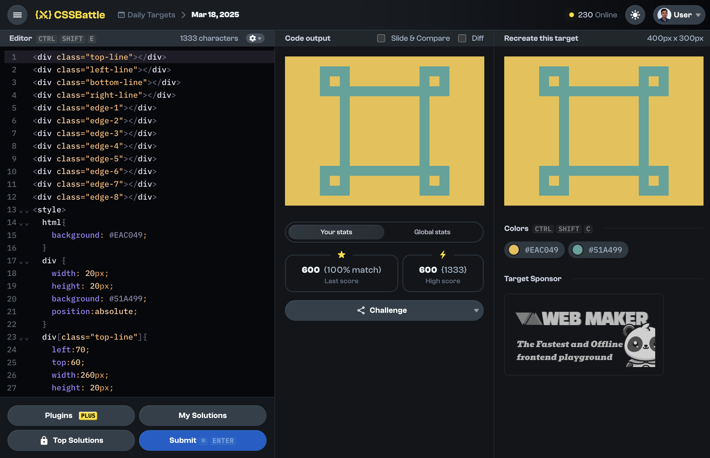

# Daily Target

## 18 March 2025

[Here is the problem](https://cssbattle.dev/play/qM6qiIkZq9FFXmk2DTuu)



```html
<div class="top-line"></div>
<div class="left-line"></div>
<div class="bottom-line"></div>
<div class="right-line"></div>
<div class="edge-1"></div>
<div class="edge-2"></div>
<div class="edge-3"></div>
<div class="edge-4"></div>
<div class="edge-5"></div>
<div class="edge-6"></div>
<div class="edge-7"></div>
<div class="edge-8"></div>
<style>
  html{
    background: #EAC049;
  }
  div {
    width: 20px;
    height: 20px;
    background: #51A499;
    position:absolute;
  }
  div[class="top-line"]{
    left:70;
    top:60;
    width:260px;
    height: 20px;
  }

  div[class="bottom-line"]{
    left:70;
    top:220;
    width:260px;
    height: 20px;
  }
  div[class="left-line"]{
    left:110;
    top:20;
    width:20px;
    height: 260px;
  }
  div[class="right-line"]{
    left:270;
    top:20;
    width:20px;
    height: 260px;
  }
  div[class="edge-1"]{
    left:70;
    top:20;
    width:40;
  }
  div[class="edge-2"]{
    left:70;
    top:40;
  }
  div[class="edge-3"]{
    left:70;
    top:260;
    width:40;
  }
  div[class="edge-4"]{
    left:70;
    top:240;
  }
  div[class="edge-5"]{
    left:290;
    top:260;
    width:40;
  }
  div[class="edge-6"]{
    left:310;
    top:240;
  }
  div[class="edge-7"]{
    left:290;
    top:20;
    width:40;
  }
  div[class="edge-8"]{
    left:310;
    top:40;
  }
</style>
```