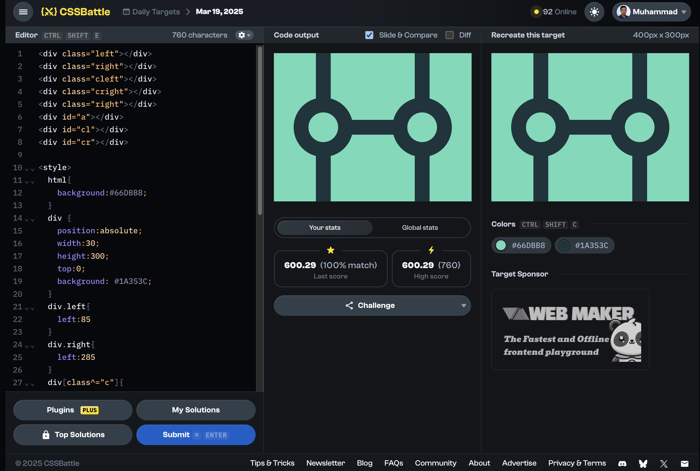

# Daily Target

## 19 March 2025

[Here is the problem](https://cssbattle.dev/play/JTTHq39YUTnR0Wl9hDjF)



```html
<div class="left"></div>
<div class="right"></div>
<div class="cleft"></div>
<div class="cright"></div>
<div class="right"></div>
<div id="a"></div>
<div id="cl"></div>
<div id="cr"></div>

<style>
  html{
    background:#66DBB8;
  }
  div {
    position:absolute;
    width:30;
    height:300;
    top:0;
    background: #1A353C;
  }
  div.left{
    left:85
  }
  div.right{
    left:285
  }
  div[class^="c"]{
    width:120;
    height:120;
    top:90;
    border-radius:100%;
  }
  div.cleft{
    left:40
  }
  div.cright{
    left:240
  }
  #a{
    transform: rotate(90deg);
    left:180;
  }
  div[id^="c"]{
    width:60;
    height:60;
    left:70;
    top:120;
    background:#66DBB8;
    border-radius:100%;
  }
  #cr{
        left:270;
  }
</style>
```