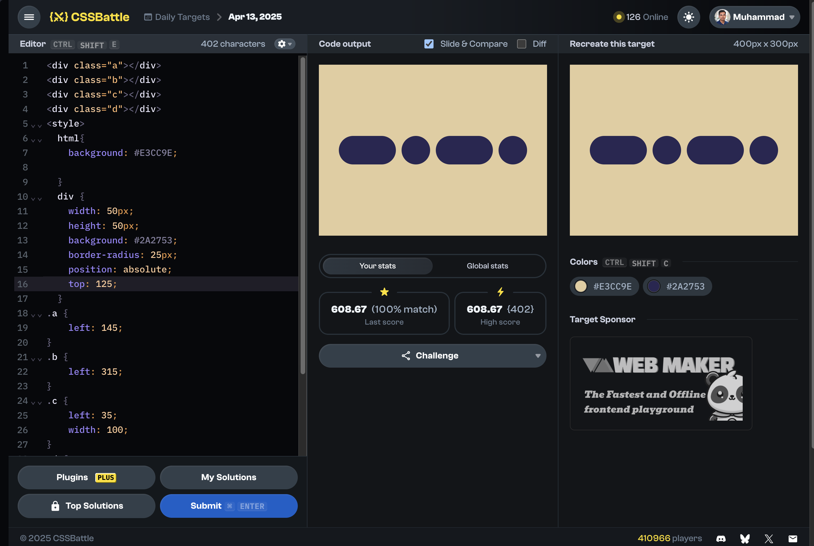

# Daily Target

## 13th April 2025

[Here is the problem](https://cssbattle.dev/play/fadGsmBXgR2J9cc97SFe)



```html
<div class="a"></div>
<div class="b"></div>
<div class="c"></div>
<div class="d"></div>
<style>
  html{
    background: #E3CC9E;
    
  }
  div {
    width: 50px;
    height: 50px;
    background: #2A2753;
    border-radius: 25px;
    position: absolute;
    top: 125;
  }
.a {
    left: 145;
}
.b {
    left: 315;
}
.c {
    left: 35;
    width: 100;
}
.d {
    left: 205;
    width: 100;
}
</style>
```